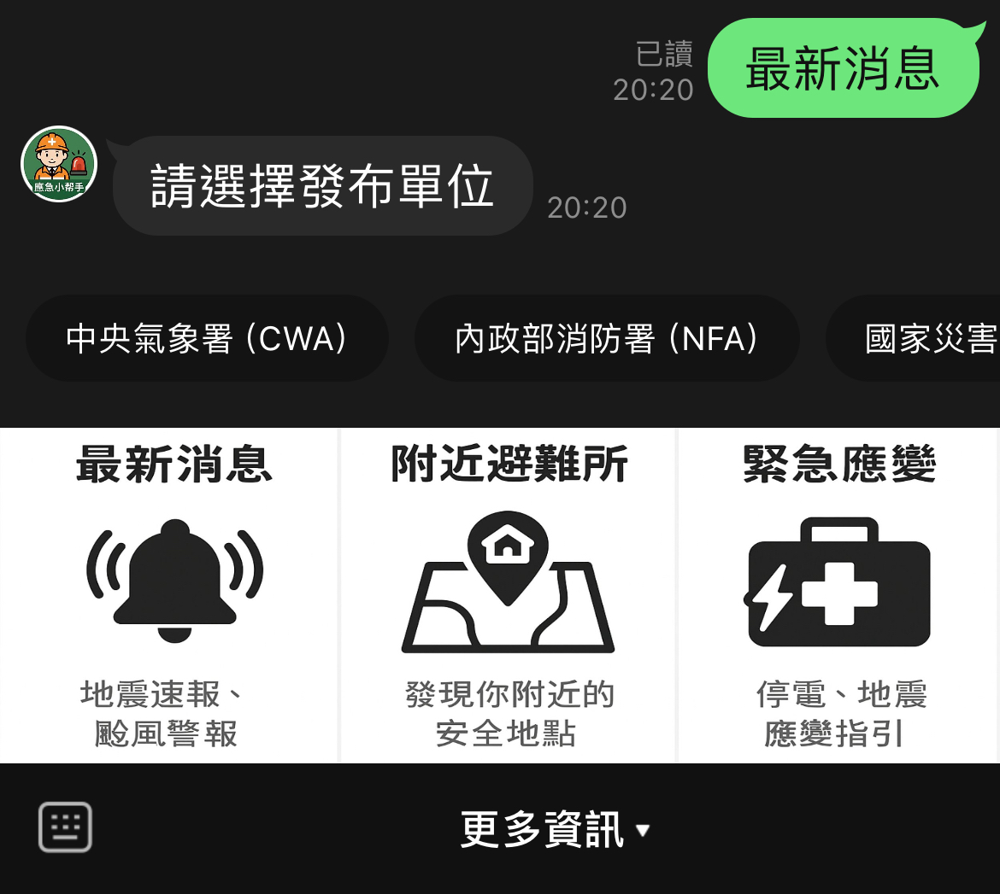
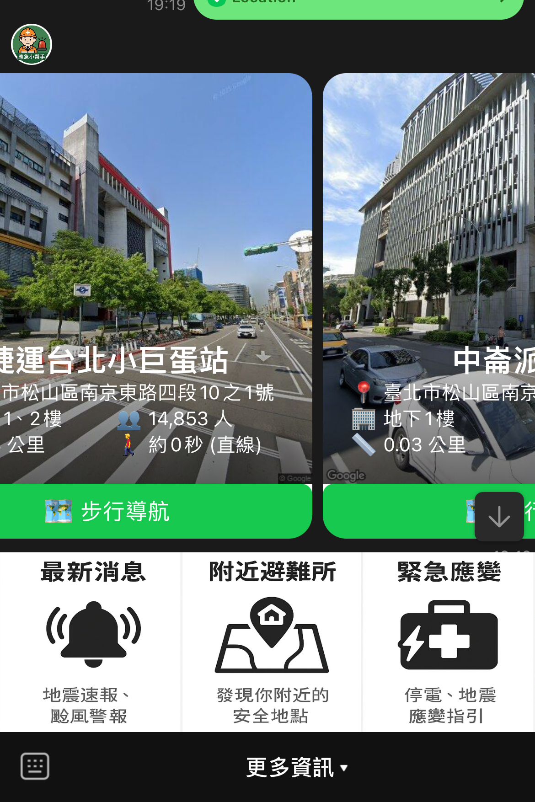
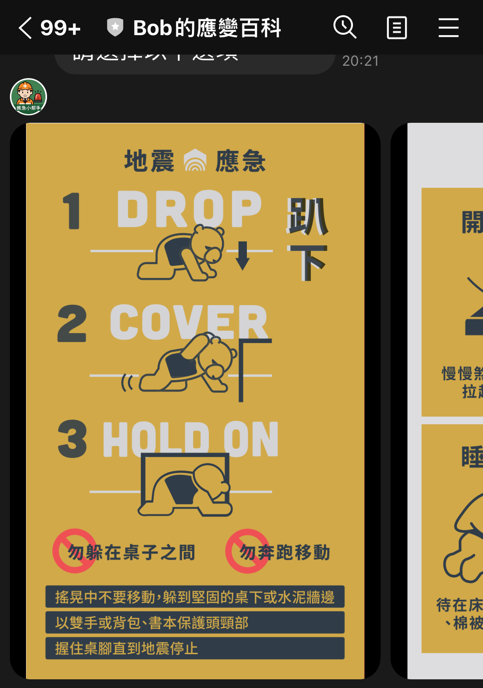

# Bob的應變百科

一款為災難應變而生的 LINE Bot。  
當災難發生時，**Bob的應變百科**可以即時提供重要資訊，協助使用者快速取得最新消息、尋找避難所、掌握緊急應變知識。

## 📱 加入 LINE 機器人

- 機器人好友 ID：`@129okfor`

點此加入好友：[https://line.me/R/ti/p/@129okfor](https://line.me/R/ti/p/@129okfor)

---

## 📡 資料來源與用途

| 資料來源 | 功能用途 | 說明 |
|----------|-----------|------|
| [Nominatim Reverse Geocoding](https://nominatim.openstreetmap.org/reverse) | 經緯度轉換為城市與行政區名稱 | 使用者傳送位置後，即時解析其所屬縣市與行政區，做為避難所資料篩選依據。 |
| [台北市資料大平台 - 避難所資料](https://data.taipei/dataset/detail?id=83eecdf1-3bbb-40f9-9484-b55b700c37ef) | 查詢最近避難所 | 根據使用者所在位置，計算距離並回傳最近三個避難所。 |
| Google Street View Static API | 顯示避難所周邊街景 | 加強避難所的地點辨識度與環境認知。 |
| Google Directions API | 計算避難所的步行距離與時間 | 使用者可以了解從所在位置步行到避難所的時間估算，提升實用性與安全性。 |

---

## 🔧 使用說明與互動流程

當使用者進入 Bot，會看到一個圖文選單，包含以下三個主要功能：

### 📷 圖文選單介面

---

### 📰 最新消息

- 點擊「最新消息」後，會出現 Quick Reply 按鈕選單，使用者可選擇：
  - 中央氣象署
  - 內政部消防署
  - 國家災害防救科技中心
- 點擊任一選項後，將自動跳轉到該單位的官方最新資訊頁面，快速取得災情與天氣預警資訊。

---

### 🏠 附近避難所

1. 點擊圖文選單中的「附近避難所」
2. 出現 Quick Reply 按鈕「📍傳送我的位置」
3. 使用者點選後傳送目前定位資訊
4. Bot 將會：
   - 使用 Nominatim API 解析所在地行政區
   - 查詢符合該區的避難所
   - 計算距離與步行時間（Google Directions API）
   - 顯示最接近的三間避難所，透過輪播卡片呈現，包含：
     - 避難所名稱與地址
     - Google 街景圖片
     - 步行距離與時間估算
     - 點選即可打開 Google 地圖導航

---

### 🚨 緊急應變

- 點擊「緊急應變」後，會出現 Quick Reply 選單

- 使用者可選擇：
  - 地震
  - 火災
  - 防空避難
- 每個主題提供簡要的行動指引與注意事項，幫助使用者在災害發生時冷靜應對

#### 📷 地震應變圖卡

---
## 📬 聯絡開發者

如有建議或問題，歡迎開 issue 或聯絡 [BobKuo](https://github.com/BobKuo)
